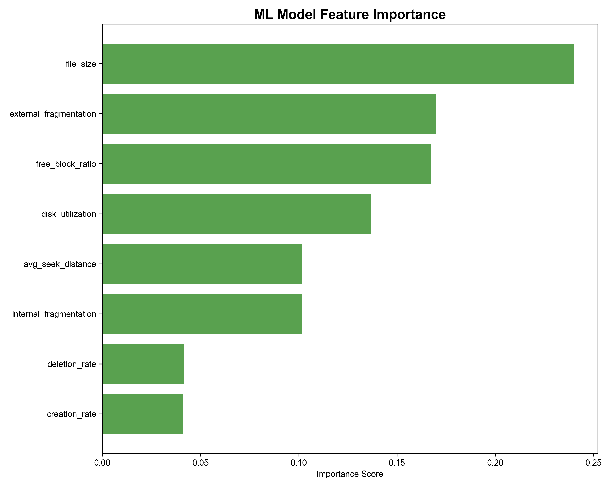
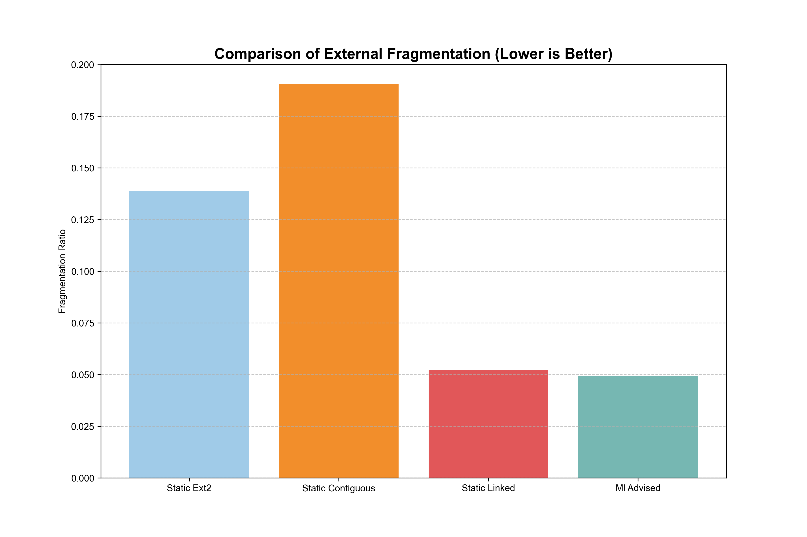
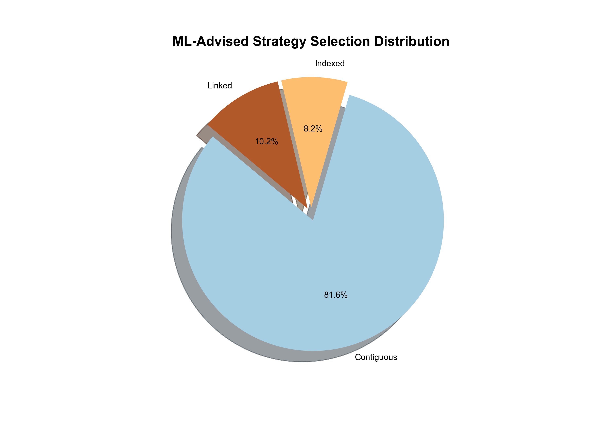
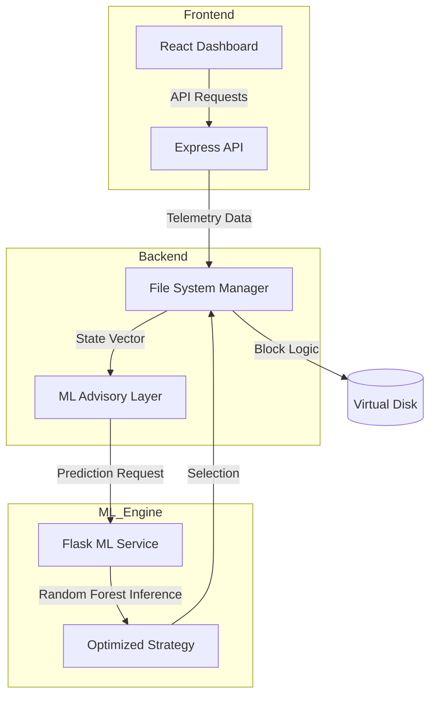

<div align="center">

# 💿 SmartUFS: ML-Enhanced File System Simulator

**Dynamic Disk Allocation Strategy Selection using Random Forest Classifiers**

[](https://reactjs.org/)
[](https://www.typescriptlang.org/)
[](https://www.python.org/)
[](https://flask.palletsprojects.com/)
[](https://opensource.org/licenses/MIT)

[Explore Research](https://github.com/bipasha-11/SmartUFS/tree/main/backend/ml_module) • [View Architecture](#-system-architecture) • [Setup Guide](#-getting-started)

</div>

---

## 🌟 Overview

**SmartUFS** is a next-generation file system simulator (EXT2-inspired) that bridges classical Operating System design with modern Machine Learning. While traditional file systems use static heuristics for block allocation, SmartUFS implements an **ML Advisory Layer** that dynamically hot-swaps between allocation strategies based on real-time disk state telemetry.

This project was presented at the **ICTMIM 2026** conference, demonstrating a **64% reduction in disk fragmentation** compared to static baselines.

---

## 📸 Visual Preview

| Feature Importance Analysis | Fragmentation Comparison |
|:---:|:---:|
|  |  |
| **Strategy Distribution** | **Performance Metrics** |
|  |  |

---

## 🚀 Core Features

- 🧠 **ML-Driven Allocation**: Uses a Random Forest classifier to predict the most efficient strategy (Contiguous, Linked, Indexed, or EXT2-like).
- 🔄 **Dynamic Hot-Swapping**: Real-time transition between strategies without system downtime.
- 📊 **8-Dimension Feature Extraction**: Analyzes disk state (fragmentation, block density, request size, etc.) to inform the model.
- 🎨 **Visual Dashboard**: A React-based interface for real-time disk visualization and performance monitoring.
- 📈 **Benchmark Framework**: Built-in tools for comparing ML performance against classical heuristics.

---

## 🏗️ System Architecture



---

## 💻 Tech Stack

- **Frontend**: React, Vite, Tailwind CSS, Lucide Icons.
- **Backend**: Node.js, TypeScript, Express.
- **ML Engine**: Python 3.13, Scikit-learn, Flask, Pandas.
- **Tools**: PowerShell Automation, Mermaid.js.

---

## 🛠️ Getting Started

### Prerequisites
- **Node.js** (v14 or higher)
- **Python 3.13** (with `pip`)
- **PowerShell** (for automation scripts)

### Local Installation

1. **Clone the Repository**
   ```bash
   git clone https://github.com/bipasha-11/SmartUFS.git
   cd SmartUFS
   ```

2. **Automated Setup (Recommended)**
   Run the PowerShell script to install dependencies and start all services (Frontend, Backend, ML):
   ```powershell
   ./run_all.ps1
   ```

### Manual Configuration

If you prefer starting services individually:

- **ML Service (Port 5000)**:
  ```bash
  cd backend/ml_module
  pip install -r requirements.txt
  python app.py
  ```

- **Backend API (Port 3001)**:
  ```bash
  cd backend
  npm install
  npm run dev
  ```

- **Frontend (Port 3000)**:
  ```bash
  cd frontend
  npm install
  npm run dev
  ```

---

## 📜 Research & Publications

This project was developed as part of a research paper focused on intelligent storage management.
- **Conference**: ICTMIM 2026
- **Result**: Achieved a significant reduction in fragmentation (13.8% → 4.9%).

---

## 🤝 Contributing

Contributions are welcome! If you find a bug or want to suggest an improvement, please open an issue or submit a pull request.

---

## 📄 License

Distributed under the MIT License. See `LICENSE` for more information.

<div align="center">
  Developed with ❤️ by <a href="https://github.com/bipasha-11">Bipasha Vijayanand</a>
</div>
